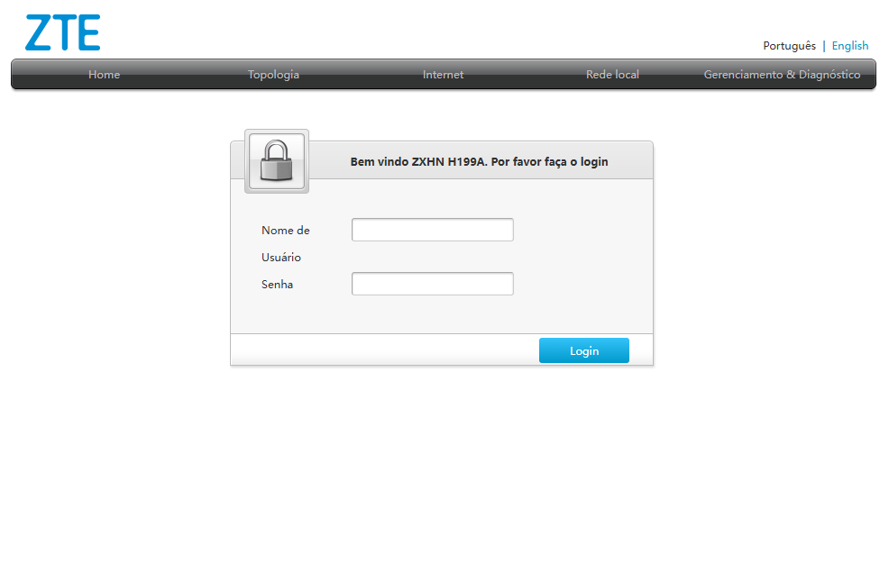
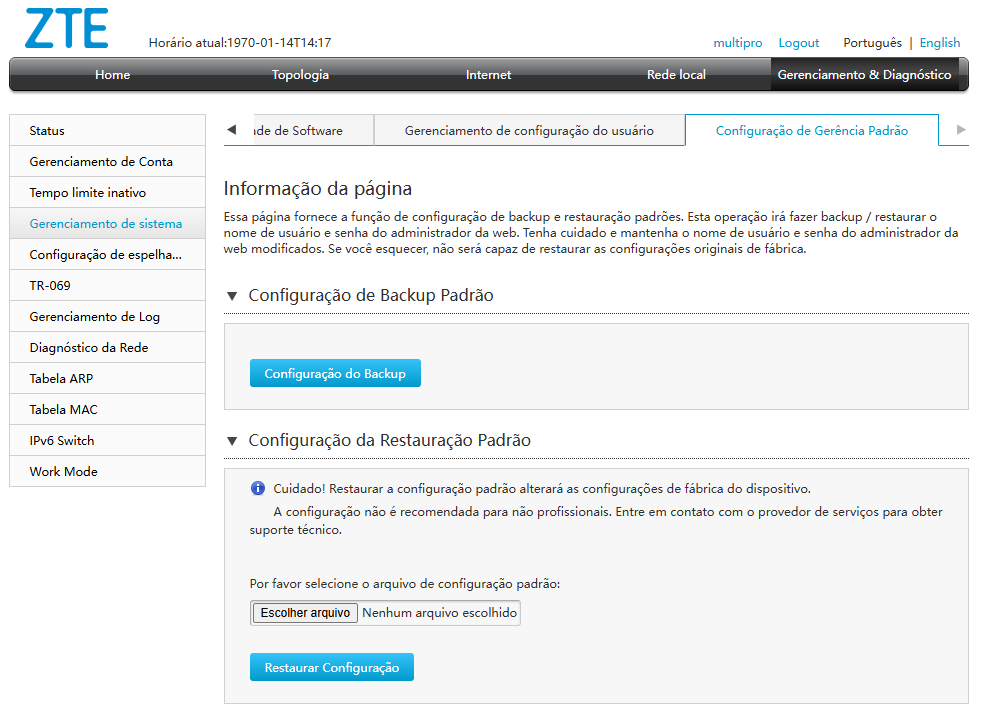
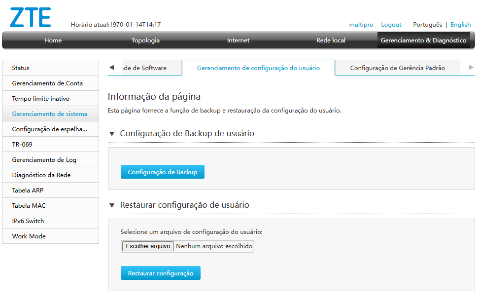

# Automação de Configuração para Roteadores ZTE H199A

Este projeto utiliza **Python** e **Selenium WebDriver** para realizar automaticamente a configuração de roteadores ZTE H199A, aplicando parâmetros personalizados de forma rápida e segura.

## 🔧 Funcionalidades

- Acesso automático à interface web do roteador
- Autenticação com usuário e senha
- Aplicação de configurações personalizadas (ex: SSID, senha Wi-Fi, modo de operação)
- Logs de execução para verificação de erros
- Suporte a múltiplos roteadores (com pequenas adaptações)

## 📸 Pré-visualização

## 📸 Pré-visualização

<p align="center">
  
  
</p>
<p align="center">
  
  
</p>

## 🚀 Tecnologias Utilizadas

- Python 3.8+
- Selenium WebDriver
- Google Chrome + ChromeDriver (ou outro navegador compatível)

## 📝 Requisitos

- Python instalado ([instale aqui](https://www.python.org/downloads/))
- Google Chrome (ou navegador suportado)
- ChromeDriver compatível com a versão do seu navegador
- Biblioteca Selenium:
  ```bash pip install selenium```

## ⚙️ Como Usar:
  1. Clone este repositório:
  git clone https://github.com/seu-usuario/nome-do-repositorio.git
  cd nome-do-repositorio

  2. Atualize o arquivo de configurações com seus dados personalizados (usuário, senha, SSID, etc.).

  3. Coloque os seus arquivos ```default_config.bin``` e ```config.bin``` dentro da pasta   ```assets``` 

  4. Execute o script:
  ```python configurar_roteador.py```

## 📂 Estrutura do Projeto
```
├── main.py                       # Script principal da automação
├── main.spec                     # Script para gerar Executável com PyInstaller    
├── await_for_ip.py               # Script que aguarda até o IP do roteador esta disponível
├── browser_utils.py              # Script para gerar Executável com PyInstaller
├── check_path_upload_exist.py    # Checa se a pasta com os arquivos .bin existe
├── favicon.ico                   # Icone caso queira gerar o executável .exe
├── login.py                      # Script para fazer login no roteador
├── navigate_system_management.py # Navega até página para subir os arquivos para upload
├── process_config_default.py     # Processo de configuração default
├── process_config_user.py        # Processo de configuração do usuários
├── upload_restore_default.py     # Upload do arquivo default_config.bin
├── upload_restore_user.py        # Upload do arquivo config.bin      
├── README.md       
```

📄 Licença
Este projeto está sob a licença MIT. Veja o arquivo LICENSE para mais detalhes.

Desenvolvido com ❤️ por Lucas Gabryel
